<div align="center">
  
  
  # 💬 Batiyoun
  ### *बातियौं* - The Future of Private Conversations
  
  **Own Your Data. Control Your Privacy. Chat Everywhere.**

  [](https://batiyoun.vercel.app/)
  [](./LICENSE)
  [](https://github.com/kushkumarkashyap7280/batiyoun)
  [](./docs/CONTRIBUTING.md)
  
  [**Live App**](https://batiyoun.vercel.app/) • [**Documentation**](./docs/) • [**Contributing**](./docs/CONTRIBUTING.md) • [**Architecture**](./docs/ARCHITECTURE.md) • [**Sponsor**](#-sponsor-this-project)
</div>

---

## 🌟 What Makes Batiyoun Different?

Batiyoun isn't just another chat app. It's a **Progressive Web Application** that puts **YOU** in control of your data and conversations.

### 💡 Core Philosophy: **Data Ownership, Not Centralization**

Unlike traditional messaging platforms where your data lives on someone else's servers forever, Batiyoun empowers users with:

- 🔐 **End-to-End Encryption** - Your messages are encrypted on your device before they leave
- 💾 **Client-Side Storage** - Store chat history, media, and files locally using IndexedDB
- 📴 **Offline-First Architecture** - Read your chats, view media, and compose messages even without internet
- 🔑 **Your Keys, Your Data** - Client-side public/private key generation and management
- 📱 **Installable PWA** - No app store approval needed. Install directly from Chrome/Edge
- 🔄 **Instant Updates** - No Play Store delays. Get features as soon as we ship them
- 🗂️ **Visual File Manager** - Manage your local chat data with an intuitive interface

> **Note:** Batiyoun is **NOT** blockchain-based or decentralized. It's about giving users *control* and *transparency* over their data through modern web technologies.

---

## ✨ Features

### 🎯 Current Features (v0.x)

- ✅ **Progressive Web App (PWA)**
  - Install on any device (Desktop, Mobile, Tablet)
  - Native app-like experience
  - Works on Windows, macOS, Linux, Android, iOS
  
- ✅ **Offline Resistance**
  - Persistent sessions without network
  - View chat history offline
  - Queue messages for sending when back online
  
- ✅ **Modern Authentication**
  - Google OAuth integration
  - Email/Password with OTP verification
  - Secure session management with Redis
  
- ✅ **Real-Time Communication**
  - WebSocket-based messaging (Socket.io)
  - Instant message delivery
  - Typing indicators (coming soon)
  
- ✅ **Automatic Updates**
  - Service Worker-based update system
  - No app store submission delays
  - Seamless background updates

### 🚧 In Development

- 🔨 **End-to-End Encryption**
  - ECDH key exchange
  - AES-256-GCM message encryption
  - Zero-knowledge architecture
  
- 🔨 **IndexedDB Storage**
  - Local message persistence
  - Media file caching (photos, videos, documents)
  - Efficient blob storage
  
- 🔨 **Visual File Manager**
  - Browse local chat data
  - Export/Import conversations
  - Manage storage quota
  
- 🔨 **Public/Private Key Management**
  - Client-side key generation
  - Secure key storage
  - Key rotation support

### 🗺️ Roadmap

- 📹 **Voice & Video Calls** (WebRTC)
- 👥 **Group Chats** with role-based permissions
- 🎨 **Themes & Customization**
- 🔍 **Full-Text Search** across messages
- 📤 **File Sharing** with encryption
- 🌙 **Dark Mode** (system-aware)
- 🔔 **Push Notifications** (with encryption)
- 🌍 **Multi-Language Support**

---

## 🏗️ Architecture

Batiyoun uses a **hybrid microservices architecture** combining serverless scalability with stateful real-time communication.

```mermaid
graph TB
    Client[Next.js PWA Client]
    AuthAPI[Next.js API Routes]
    SocketServer[Node.js WebSocket Server]
    PostgreSQL[(PostgreSQL)]
    MongoDB[(MongoDB)]
    Redis[(Redis)]
    
    Client -->|REST API| AuthAPI
    Client -->|WebSocket| SocketServer
    AuthAPI -->|Prisma ORM| PostgreSQL
    SocketServer -->|Mongoose| MongoDB
    AuthAPI -->|Session Cache| Redis
    SocketServer -->|Pub/Sub| Redis
    
    style Client fill:#61dafb
    style AuthAPI fill:#000000
    style SocketServer fill:#68a063
    style PostgreSQL fill:#336791
    style MongoDB fill:#4db33d
    style Redis fill:#dc382d
```



### 🧩 Polyglot Persistence Pattern

| Component | Technology | Purpose |
|-----------|-----------|---------|
| **Client** | Next.js 15 (App Router), React 19, TypeScript | PWA, UI, Client-side logic |
| **Auth Service** | Next.js API Routes, Prisma ORM | User management, Authentication |
| **Auth Database** | PostgreSQL (Vercel Postgres) | ACID-compliant user data |
| **Realtime Server** | Node.js, Express, Socket.io | WebSocket management, Message routing |
| **Chat Database** | MongoDB | High-write throughput for messages |
| **Cache Layer** | Redis | Session storage, Pub/Sub, Rate limiting |
| **Shared Types** | `@batiyoun/common` (Zod + TypeScript) | Type-safe contracts between services |
| **File Storage** | Cloudinary | Avatar uploads |
| **Deployment** | Vercel (Client + Auth), Railway (Server) | Serverless + Container hosting |

**📚 [Detailed Architecture Documentation](./docs/ARCHITECTURE.md)**

---

## 🚀 Quick Start

### Prerequisites

- **Node.js** v20.x or higher
- **PostgreSQL** database
- **MongoDB** cluster
- **Redis** instance (optional for development)

### Installation

1. **Clone the repository**
   ```bash
   git clone https://github.com/kushkumarkashyap7280/batiyoun.git
   cd batiyoun
   ```

2. **Install dependencies**
   ```bash
   npm install
   ```

3. **Environment Configuration**

   Copy sample environment files:
   ```bash
   cp client/sample.env client/.env
   cp server/sample.env server/.env
   ```

   Update the `.env` files with your credentials. See [Environment Setup Guide](./docs/ENVIRONMENT.md) for details.

4. **Database Setup**

   Run Prisma migrations for PostgreSQL:
   ```bash
   cd client
   npx prisma migrate dev
   npx prisma generate
   ```

5. **Start Development Servers**

   From the root directory:
   ```bash
   npm run dev
   ```

   This starts:
   - Client: `http://localhost:3000`
   - Server: `http://localhost:4000`

6. **Access the App**

   Open [http://localhost:3000](http://localhost:3000) in your browser.

**📖 [Complete Setup Guide](./docs/INSTALLATION.md)**

---

## 📂 Project Structure

```
batiyoun/
├── client/                 # Next.js PWA Application
│   ├── app/               # App Router (Pages & API Routes)
│   │   ├── (auth)/       # Authentication pages
│   │   ├── (main)/       # Main app pages (chat, profile, settings)
│   │   └── api/          # Next.js API endpoints
│   ├── components/        # React components
│   │   ├── auth-components/
│   │   ├── landing/
│   │   ├── layout/
│   │   ├── profile/
│   │   ├── settings/
│   │   └── ui/           # shadcn/ui components
│   ├── lib/              # Utilities & clients
│   │   ├── prisma.ts    # Prisma client
│   │   ├── redis.ts     # Redis client
│   │   └── cloudinary.ts
│   ├── prisma/           # Database schema & migrations
│   ├── public/           # Static assets, PWA icons, Service Worker
│   ├── store/            # Zustand state management
│   └── utils/            # Helper functions
│
├── server/                # Node.js WebSocket Server
│   └── src/
│       ├── config/       # Database & environment config
│       ├── controllers/  # Socket event handlers
│       ├── models/       # Mongoose schemas
│       ├── routes/       # REST API routes
│       ├── services/     # Business logic
│       ├── middlewares/  # Auth, validation, error handling
│       └── utils/        # Server utilities
│
├── common/                # Shared TypeScript Package
│   ├── types.ts          # Shared type definitions
│   └── errors.ts         # Common error classes
│
└── docs/                  # Documentation
    ├── ARCHITECTURE.md
    ├── CONTRIBUTING.md
    ├── API.md
    └── SECURITY.md
```

---

## 🛡️ Security

Security is at the core of Batiyoun. We're implementing:

- 🔐 **End-to-End Encryption** using ECDH + AES-256-GCM
- 🔑 **Client-Side Key Generation** (Web Crypto API)
- 🚫 **Zero-Knowledge Architecture** - Server can't read your messages
- 🛡️ **Content Security Policy (CSP)**
- 🔒 **HTTP-Only Cookies** for session management
- ⚡ **Rate Limiting** on all endpoints
- 🔍 **Input Validation** with Zod schemas
- 🧪 **Regular Security Audits**

**⚠️ [Security Policy & Reporting](./docs/SECURITY.md)**

---

## 🤝 Contributing

Batiyoun is open-source and community-driven. We welcome contributions of all kinds!

### Ways to Contribute

- 🐛 **Report bugs** via [GitHub Issues](https://github.com/kushkumarkashyap7280/batiyoun/issues)
- 💡 **Suggest features** or improvements
- 📝 **Improve documentation**
- 🧑‍💻 **Submit pull requests**
- ⭐ **Star the repository** to show support
- 🗣️ **Spread the word** about Batiyoun

**📋 [Contribution Guidelines](./docs/CONTRIBUTING.md)**

---

## 💖 Sponsor This Project

Building Batiyoun takes time, effort, and infrastructure costs. Your support helps:

- 🚀 **Speed up development** of new features
- 🌐 **Keep the demo server running**
- 📚 **Improve documentation**
- 🔬 **Conduct security audits**
- 🎨 **Enhance user experience**

### Sponsor Options

- 💳 **[Razorpay](https://razorpay.me/@kushkumar7889)** - UPI, Cards, NetBanking (India & International)
- 💰 **[GitHub Sponsors](https://github.com/sponsors/kushkumarkashyap7280)** (coming soon)
- 🏆 **[Open Collective](https://opencollective.com/batiyoun)** (coming soon)

### Current Sponsors

*Be the first to sponsor Batiyoun!*

---

## 📱 Technology Stack

### Frontend
- **Framework:** Next.js 15 (React 19, App Router)
- **Language:** TypeScript
- **Styling:** Tailwind CSS
- **UI Components:** shadcn/ui (Radix UI)
- **State Management:** Zustand
- **Forms:** React Hook Form + Zod
- **PWA:** Workbox, Service Workers

### Backend
- **Runtime:** Node.js
- **Framework:** Express
- **Real-time:** Socket.io
- **Language:** TypeScript

### Databases & Storage
- **User Data:** PostgreSQL (Prisma ORM)
- **Messages:** MongoDB (Mongoose)
- **Cache:** Redis (Upstash)
- **Files:** Cloudinary
- **Client Storage:** IndexedDB (Dexie.js - coming soon)

### DevOps & Tools
- **Package Manager:** npm workspaces
- **Build Tool:** Turbo (planned)
- **Linting:** ESLint
- **Type Checking:** TypeScript
- **Deployment:** Vercel (Client), Railway (Server)
- **Testing:** Vitest (planned)

---

## 📊 Project Status

| Feature | Status | Version |
|---------|--------|---------|
| PWA Installation | ✅ Live | v0.1.0 |
| Google OAuth | ✅ Live | v0.1.0 |
| Email/Password Auth | ✅ Live | v0.1.0 |
| Offline Sessions | ✅ Live | v0.2.0 |
| Auto-Updates | ✅ Live | v0.2.0 |
| WebSocket Messaging | 🚧 Development | - |
| E2E Encryption | 🚧 Development | - |
| IndexedDB Storage | 📋 Planned | - |
| File Manager | 📋 Planned | - |
| Voice/Video Calls | 📋 Planned | - |

---

## 📄 License

This project is licensed under the **MIT License** - see the [LICENSE](./LICENSE) file for details.

This means you can:
- ✅ Use commercially
- ✅ Modify
- ✅ Distribute
- ✅ Private use

Just include the original license and copyright notice.

---

## 🙏 Acknowledgments

- **Next.js Team** for the amazing framework
- **Socket.io** for real-time capabilities
- **Prisma** for the excellent ORM
- **shadcn/ui** for beautiful components
- **Vercel** for generous hosting
- All **contributors** who make this project better

---

## 📞 Contact & Support

- 🐛 **Issues:** [GitHub Issues](https://github.com/kushkumarkashyap7280/batiyoun/issues)
- 💬 **Discussions:** [GitHub Discussions](https://github.com/kushkumarkashyap7280/batiyoun/discussions)
- 📧 **Email:** kushkumarkashyap7280@gmail.com
- 🐦 **Twitter:** [@kushkumar](https://twitter.com/kushkumar) (coming soon)

---

## 🌟 Star History

[](https://star-history.com/#kushkumarkashyap7280/batiyoun&Date)

---

<div align="center">
  
  ### Built with ❤️ by [Kush Kumar](https://github.com/kushkumarkashyap7280)
  
  **If you find Batiyoun useful, please consider giving it a ⭐ on GitHub!**
  
  [⬆ Back to Top](#-batiyoun)
  
</div>