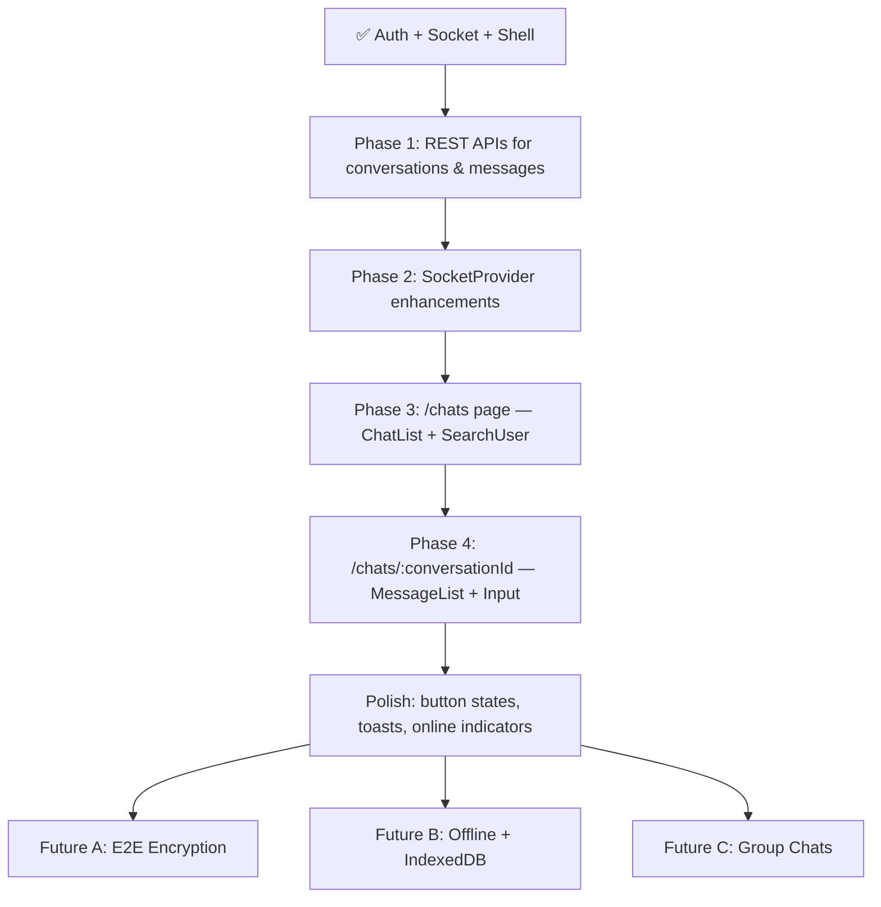

# 🗺️ Batiyoun PWA — Master Development Plan

> **Stack**: Next.js (client) · Express + Socket.io (server) · MongoDB (Mongoose) · CSS Modules · Lucide React icons
> **Deployed on**: Render (server cold-start aware — `LoadingAuth` covers this)

---

## ✅ What Is Already Built

### Infrastructure

| Layer                                    | Status  | Notes                                                             |
| ---------------------------------------- | ------- | ----------------------------------------------------------------- |
| **Auth flow** (`AuthProvider`)           | ✅ Done | JWT cookie, `verifyMeBUser`, redirect logic, `LoadingAuth` splash |
| **Socket connection** (`SocketProvider`) | ✅ Done | Connects only after auth resolves, uses `socketToken`             |
| **Theme provider**                       | ✅ Done | Dark/light toggle                                                 |
| **Protected shell**                      | ✅ Done | Sidebar (desktop 4%), bottom nav (mobile), logout, user avatar    |
| **WorkspaceProvider**                    | ✅ Done | `hideMobileNav` for conversation detail pages                     |

### Server (Express + Socket.io)

| Feature                                        | Status                                                                                         |
| ---------------------------------------------- | ---------------------------------------------------------------------------------------------- |
| `POST /users/create-buser`                     | ✅ Done                                                                                        |
| `POST /users/login-buser`                      | ✅ Done                                                                                        |
| `GET /users/verify-me-buser`                   | ✅ Done                                                                                        |
| `POST /users/logout-buser`                     | ✅ Done                                                                                        |
| `GET /users/search-buser?prefix=&page=&limit=` | ✅ Done                                                                                        |
| `socket: message:send`                         | ✅ Done — creates/finds conversation, saves message, emits `message:received` & `message:sent` |

### Data Models

| Model          | Status | Fields                                                                      |
| -------------- | ------ | --------------------------------------------------------------------------- |
| `User`         | ✅     | username, email, fullName, password (hashed), avatar                        |
| `Conversation` | ✅     | participants[], lastMessage, isGroup, groupName, groupAvatar, groupAdmins[] |
| `Message`      | ✅     | conversationId, senderId, content                                           |

### Client Pages

| Page                     | Status                   |
| ------------------------ | ------------------------ |
| `/` (Home)               | ✅ Done                  |
| `/login`                 | ✅ Done                  |
| `/signup`                | ✅ Done                  |
| `/chats`                 | ❌ **Missing — MVP gap** |
| `/chats/:conversationId` | ❌ **Missing — MVP gap** |
| `/profile`               | ✅ Shell exists          |
| `/settings`              | ✅ Shell exists          |
| `/notifications`         | ❌ Not in nav yet        |

---

## 🚧 MVP — What We Need to Build Next

> **Goal**: A user can search for another user, start a chat, send/receive real-time messages, and see their conversation list.

### Phase 1 — `/chats` Page (Chat List + Search)

#### 1A. Server — Missing APIs

We need these REST endpoints:

| Method | Path                                      | Purpose                                                                                |
| ------ | ----------------------------------------- | -------------------------------------------------------------------------------------- |
| `GET`  | `/conversations/my-conversations`         | List all conversations for logged-in user (with last message + other participant info) |
| `GET`  | `/conversations/:conversationId/messages` | Paginated message history for a conversation                                           |
| `GET`  | `/conversations/:conversationId`          | Single conversation details                                                            |

> These are **read APIs** — the write path (create conversation + send first message) already goes through socket `message:send`.

#### 1B. Server — Socket Events to Add

| Event (client → server)         | Event (server → client) | Purpose                                                                   |
| ------------------------------- | ----------------------- | ------------------------------------------------------------------------- |
| `conversation:join`             | —                       | Client joins a room for a specific conversation                           |
| `conversation:leave`            | —                       | Client leaves a room                                                      |
| `message:send` (already exists) | `message:received` ✅   | Send & receive messages                                                   |
| —                               | `conversation:updated`  | Notify chat list when a new message arrives (update last message preview) |
| `user:online`                   | `user:status`           | Online/offline indicator                                                  |

#### 1C. Client — `SocketProvider` Enhancements

Add to context:

```ts
type SocketContextType = {
  socket: Socket | null;
  isConnected: boolean;
  // New additions:
  sendMessage: (senderId: string, receiverId: string, content: string) => void;
  joinConversation: (conversationId: string) => void;
  leaveConversation: (conversationId: string) => void;
  onlineUsers: string[]; // user IDs currently online
};
```

The provider will maintain a `onlineUsers` state, listening to `user:status` events.

#### 1D. Client — New API calls (`apis/api.ts`)

```ts
// Fetch all conversations for logged-in user
getMyConversations(): Promise<Conversation[]>

// Fetch paginated messages for a conversation
getConversationMessages(conversationId: string, page: number): Promise<Message[]>
```

---

### Phase 2 — Component Architecture for `/chats`

Following the established pattern from `plan.md`:

```
client/
  app/
    (protected)/
      chats/
        page.tsx                    ← server component (no metadata for protected)
        [conversationId]/
          page.tsx                  ← server component
  components/
    pages/
      chats/
        ChatsClient.tsx             ← main client component for /chats
        SubComponents/
          SearchUser/
            SearchUser.tsx
            SearchUser.module.css
          ChatList/
            ChatList.tsx
            ChatList.module.css
          ChatListItem/
            ChatListItem.tsx
            ChatListItem.module.css
      chat/
        ChatClient.tsx              ← main client component for /chats/:conversationId
        SubComponents/
          MessageBubble/
            MessageBubble.tsx
            MessageBubble.module.css
          MessageInput/
            MessageInput.tsx
            MessageInput.module.css
          ChatHeader/
            ChatHeader.tsx
            ChatHeader.module.css
          MessageList/
            MessageList.tsx
            MessageList.module.css
```

---

### Phase 3 — UI Specification

#### `/chats` Page Layout

```
┌─────────────────────────────────────────────┐
│  🔍 Search Users by username                │  ← SearchUser component
│     [shows results with pagination]         │
├─────────────────────────────────────────────┤
│  💬 Your Conversations                      │  ← ChatList component
│  ┌──────────────────────────────────────┐   │
│  │ [avatar] @username    12:34 PM  [3]  │   │  ← ChatListItem (unread badge)
│  │          Last message preview...     │   │
│  └──────────────────────────────────────┘   │
│  ┌──────────────────────────────────────┐   │
│  │ [avatar] @username    Yesterday      │   │
│  │          Last message preview...     │   │
│  └──────────────────────────────────────┘   │
└─────────────────────────────────────────────┘
```

#### SearchUser Component — Detail Behaviour

- **Input**: debounced (300ms), TanStack Query with 5 users/page
- **Result card (no existing conversation)**:
  - Shows: avatar initial, username, fullName
  - Shows: text input for first message + "Send" button
  - Button states: initial → loading (spinner, disabled) → success (tick) → error (cross + retry)
  - On success: redirect to `/chats/:conversationId`
- **Result card (conversation exists)**:
  - Shows: avatar, username, last message preview
  - No input needed — click navigates to `/chats/:conversationId`

#### `/chats/:conversationId` Page Layout

```
┌─────────────────────────────────────────────┐
│  ← [avatar] @username  🟢 online           │  ← ChatHeader
├─────────────────────────────────────────────┤
│                                             │
│    [timestamp divider]                      │
│                          [My message]  ✓✓  │  ← MessageBubble (sent)
│   [Their message]                           │  ← MessageBubble (received)
│                          [My message]  ✓✓  │
│                                             │
│              [Load more ↑]                  │  ← infinite scroll (TanStack Query)
│                                             │
├─────────────────────────────────────────────┤
│  📎  Type a message...          [Send →]    │  ← MessageInput
└─────────────────────────────────────────────┘
```

- Mobile: hides bottom nav via `hideMobileNav` from `WorkspaceProvider` (already wired)
- Desktop: shows side by side with `/chats` panel

---

### Phase 4 — Button State Rule (from plan.md — apply EVERYWHERE)

Every interactive button must implement all 4 states:

```ts
type ButtonState = 'idle' | 'loading' | 'success' | 'error';
```

| State     | UI                                                       |
| --------- | -------------------------------------------------------- |
| `idle`    | Normal label / icon                                      |
| `loading` | `<Loader2 className="spin" />` — button disabled         |
| `success` | `<Check />` green tick — brief (1.5s), then back to idle |
| `error`   | `<X />` cross + toast error message + retry option       |

---

## 🔮 Future Features (Post-MVP Roadmap)

### Feature A — End-to-End Encryption (`kush-e2e`)

**Approach:**

1. On first login/signup, generate an identity key pair using `KushE2E.createIdentity()`
2. Store `privateKey` in **IndexedDB** (never leaves device)
3. Store `publicKey` on server (new field on User model)
4. On opening a conversation, fetch other user's `publicKey`, derive `sessionKey`
5. All `message:send` events carry encrypted content
6. `MessageBubble` decrypts on render using sessionKey from IndexedDB

**New APIs needed:**

- `PUT /users/public-key` — store user's public key
- `GET /users/:userId/public-key` — fetch another user's public key

---

### Feature B — Offline Support (PWA Service Worker + IndexedDB)

**Service Worker** (already manifest/SW skeleton exists from prior work):

- Cache shell HTML, CSS, JS assets (Cache First strategy)
- Cache API responses for `/conversations/my-conversations` (Network First with fallback)

**IndexedDB schema** (via `idb` or `Dexie.js`):

```
DB: batiyoun
  store: messages      { conversationId, messageId, senderId, content, timestamp, synced }
  store: conversations { conversationId, participants, lastMessage, unreadCount }
  store: e2e_keys      { userId, privateKey, publicKey } ← for future E2E
```

**Offline send queue**: messages typed offline queued in IndexedDB, replayed when socket reconnects.

---

### Feature C — Group Chats

> Model already has `isGroup`, `groupName`, `groupAvatar`, `groupAdmins[]` fields. ✅

**What needs building:**

1. `POST /conversations/create-group` — server endpoint
2. `PUT /conversations/:id/add-member`
3. `PUT /conversations/:id/remove-member`
4. New UI: "Create Group" button in `/chats`, group info panel, admin controls
5. Socket: `message:send` already handles group rooms (join all participants)

---

## 📋 Implementation Order (Recommended)



---

## 🧱 Coding Rules (from plan.md — must follow always)

1. **File structure**: Each page component lives in `@/components/pages/<pageName>/PageClient.tsx` with `SubComponents/<Name>/<Name>.tsx` + `<Name>.module.css`
2. **Styling**: `module.css` only — no inline styles, no Tailwind
3. **Icons**: `lucide-react` exclusively
4. **CSS variables**: Use globals from `global.css` — import via `@value` or CSS custom props in module files
5. **Button states**: ALL 4 states (idle / loading / success / error) on every interactive button
6. **Public pages**: `page.tsx` (server, has `export const metadata`) + `PageClient.tsx` (client)
7. **Protected pages**: All client-rendered — no metadata export needed
8. **TanStack Query**: Use for all data fetching (search = 5/page pagination, messages = infinite scroll)

---

## ❓ Open Questions Before Coding

1. **Unread message count** — tracked server-side (field on conversation) or client-side (via socket events)?
2. **Message pagination** — how many messages per page? (Recommended: 20)
3. **Online/offline status** — do we track it on socket connect/disconnect events?
4. **Avatar** — currently showing initial letter. Is uploading a real avatar image in scope for MVP?
5. **Notifications page** — is this in MVP scope or future?
