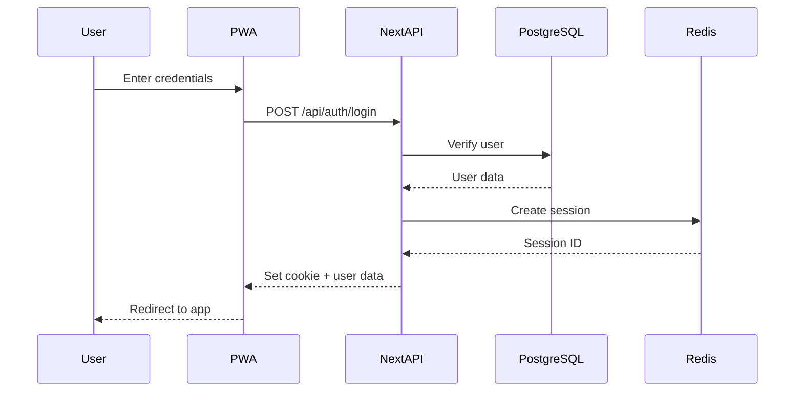
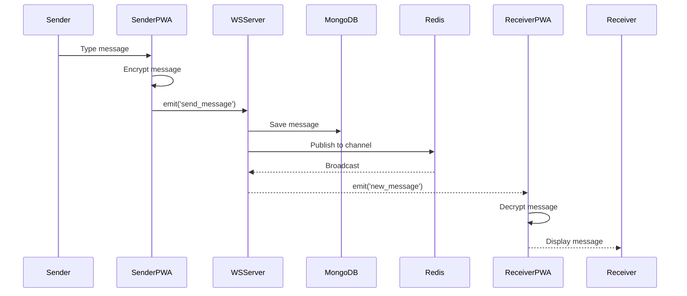
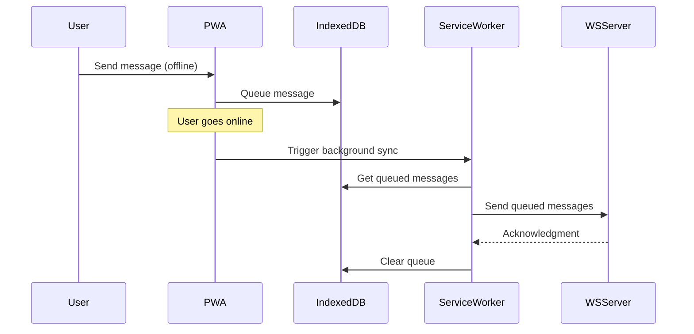
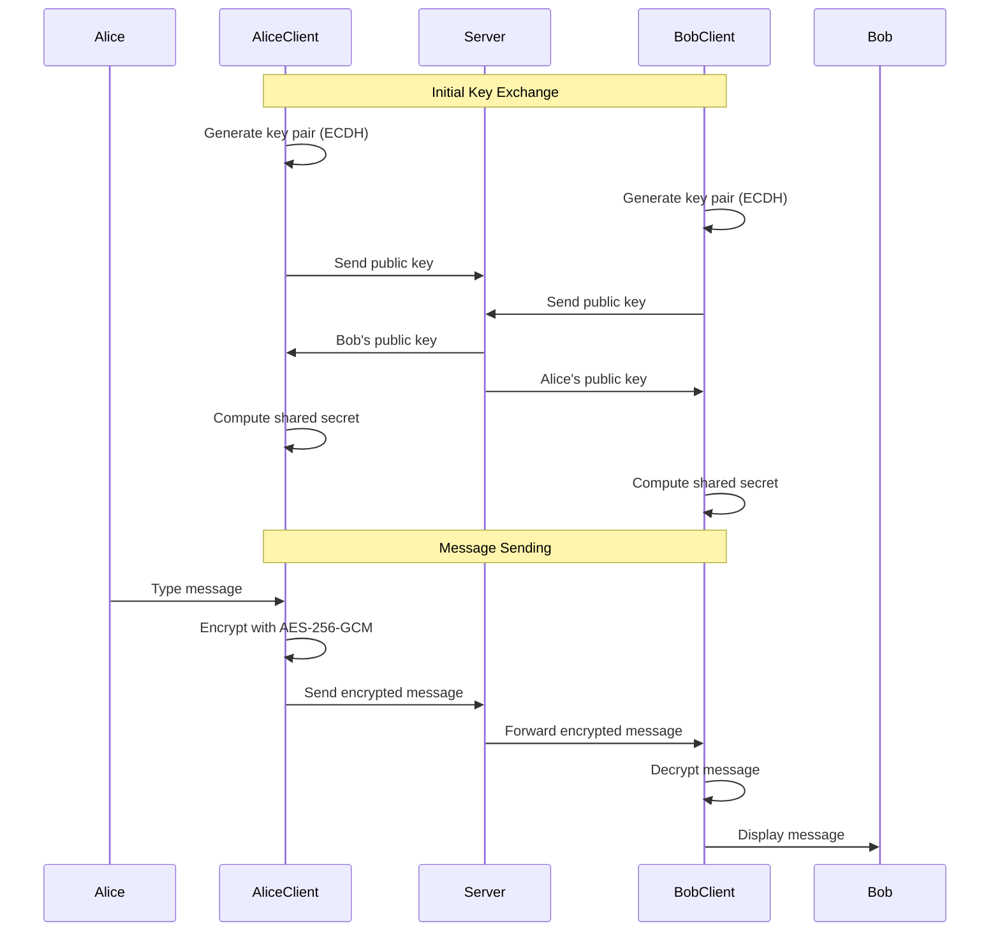

# Batiyoun Architecture Documentation 🏗️

This document provides a comprehensive overview of Batiyoun's technical architecture, design decisions, and system components.

## 📋 Table of Contents

- [Overview](#overview)
- [Architecture Principles](#architecture-principles)
- [System Architecture](#system-architecture)
- [Data Flow](#data-flow)
- [Component Details](#component-details)
- [Database Schema](#database-schema)
- [Security Architecture](#security-architecture)
- [Deployment Architecture](#deployment-architecture)
- [Performance Considerations](#performance-considerations)

---

## Overview

Batiyoun employs a **hybrid microservices architecture** that combines:

1. **Serverless Functions** (Next.js API Routes) for authentication and user management
2. **Stateful WebSocket Server** (Node.js + Socket.io) for real-time messaging
3. **Polyglot Persistence** (PostgreSQL + MongoDB + Redis) for optimized data storage
4. **Progressive Web App** (PWA) for offline-first, installable experience

### Key Architectural Goals

- 🎯 **Scalability:** Handle millions of concurrent connections
- ⚡ **Performance:** Sub-100ms message delivery
- 🔒 **Security:** End-to-end encryption, zero-knowledge architecture
- 📴 **Resilience:** Offline-first design with eventual consistency
- 💰 **Cost-Efficiency:** Optimize infrastructure costs through smart architecture

---

## Architecture Principles

### 1. Separation of Concerns

Different services handle different responsibilities:
- **Next.js (Client + Auth):** UI rendering, authentication, user management
- **Node.js Server:** Real-time communication, message routing
- **PostgreSQL:** User data, relationships (ACID compliance needed)
- **MongoDB:** Messages, chat data (high write throughput needed)
- **Redis:** Caching, sessions, pub/sub

### 2. Polyglot Persistence

Use the right database for the right job:

| Data Type | Database | Reason |
|-----------|----------|--------|
| Users, Auth | PostgreSQL | ACID compliance, relational integrity |
| Messages | MongoDB | High write speed, flexible schema |
| Sessions | Redis | Fast read/write, TTL support |
| Files | Cloudinary | CDN, image optimization |
| Client Cache | IndexedDB | Offline storage, large blobs |

### 3. API-First Design

All services communicate through well-defined APIs:
- **REST API** for CRUD operations (Next.js API Routes)
- **WebSocket** for real-time bidirectional communication
- **Shared Types** via TypeScript (client/types and client/utils)

### 4. Progressive Enhancement

- Works offline with degraded functionality
- Graceful fallbacks for unsupported features
- Service Worker for caching and background sync

---

## System Architecture

```mermaid
graph TB
    subgraph "Client Layer"
        PWA[PWA Client<br/>Next.js + React]
        SW[Service Worker]
        IDB[(IndexedDB)]
    end

    subgraph "API Gateway Layer"
        NextAPI[Next.js API Routes<br/>Authentication]
        WSServer[WebSocket Server<br/>Socket.io]
    end

    subgraph "Service Layer"
        AuthService[Auth Service<br/>Prisma]
        ChatService[Chat Service<br/>Mongoose]
        FileService[File Service<br/>Cloudinary]
    end

    subgraph "Data Layer"
        PostgreSQL[(PostgreSQL<br/>Users, Auth)]
        MongoDB[(MongoDB<br/>Messages)]
        Redis[(Redis<br/>Cache, Sessions)]
        Cloudinary[Cloudinary<br/>File Storage]
    end

    PWA -->|REST| NextAPI
    PWA -->|WebSocket| WSServer
    PWA -->|Cache| SW
    SW -->|Store| IDB

    NextAPI --> AuthService
    WSServer --> ChatService
    
    AuthService --> PostgreSQL
    AuthService --> Redis
    ChatService --> MongoDB
    ChatService --> Redis
    FileService --> Cloudinary

    style PWA fill:#61dafb
    style NextAPI fill:#000000
    style WSServer fill:#68a063
    style PostgreSQL fill:#336791
    style MongoDB fill:#4db33d
    style Redis fill:#dc382d
```



---

## Data Flow

### Authentication Flow



### Message Flow (Real-time)



### Offline Message Queue Flow



---

## Component Details

### Client (Next.js PWA)

**Technology Stack:**
- Next.js 15 (App Router)
- React 19
- TypeScript
- Tailwind CSS + shadcn/ui
- Zustand (state management)
- Workbox (PWA/Service Worker)

**Responsibilities:**
- UI rendering (Server + Client Components)
- Authentication UI
- Real-time message display
- Offline caching
- Client-side encryption (coming soon)
- Local data management (IndexedDB)

**Key Files:**
- `app/layout.tsx` - Root layout with providers
- `app/(auth)/` - Authentication pages
- `app/(main)/` - Main app pages
- `app/api/auth/` - Auth API routes
- `components/` - Reusable components
- `lib/prisma.ts` - Database client
- `public/sw.js` - Service Worker

### Authentication Service (Next.js API Routes)

**Responsibilities:**
- User registration and login
- Google OAuth integration
- Email OTP verification
- Session management
- Password hashing (bcrypt)
- JWT token generation

**Endpoints:**
- `POST /api/auth/signup` - User registration
- `POST /api/auth/login` - User login
- `POST /api/auth/request-otp` - Send OTP email
- `POST /api/auth/verify-otp` - Verify OTP
- `GET /api/auth/verify-me` - Check session
- `POST /api/auth/logout` - End session
- `GET /api/auth/google` - OAuth redirect
- `GET /api/auth/google/callback` - OAuth callback

### WebSocket Server (Node.js)

**Technology Stack:**
- Node.js
- Express
- Socket.io
- Mongoose (MongoDB ODM)
- TypeScript

**Responsibilities:**
- WebSocket connection management
- Real-time message routing
- Presence tracking (online/offline)
- Typing indicators
- Message persistence (MongoDB)
- Pub/Sub via Redis

**Socket Events:**
```typescript
// Client → Server
socket.emit('join_chat', { chatId })
socket.emit('send_message', { chatId, content, encrypted })
socket.emit('typing', { chatId })
socket.emit('read_receipt', { messageId })

// Server → Client
socket.on('new_message', (message) => {})
socket.on('user_typing', (userId) => {})
socket.on('user_online', (userId) => {})
socket.on('message_read', (messageId) => {})
```

### Shared Types (client/types & client/utils)

**Purpose:** Type-safe contracts between services

**Contents:**
- `client/types/types.ts` - Shared TypeScript interfaces
- `client/utils/errors.ts` - Custom error classes
- Validation schemas

**Example:**
```typescript
// types.ts
export interface Message {
  id: string;
  chatId: string;
  senderId: string;
  content: string;
  encrypted: boolean;
  timestamp: Date;
}

// Validation
export const messageSchema = z.object({
  chatId: z.string().uuid(),
  content: z.string().min(1).max(5000),
  encrypted: z.boolean()
});
```

---

## Database Schema

### PostgreSQL (User Data)

```prisma
model User {
  id            String    @id @default(uuid())
  email         String    @unique
  username      String    @unique
  passwordHash  String?
  displayName   String?
  avatar        String?
  provider      String?   // "email" | "google"
  providerId    String?
  verified      Boolean   @default(false)
  createdAt     DateTime  @default(now())
  updatedAt     DateTime  @updatedAt
  
  // Relations (coming soon)
  // chats         ChatMember[]
  // sentMessages  Message[]
}
```

### MongoDB (Chat Data)

```typescript
// Message Schema
{
  _id: ObjectId,
  chatId: String,
  senderId: String,
  content: String,        // Encrypted content
  iv: String,             // Initialization vector
  encrypted: Boolean,
  type: "text" | "image" | "file",
  metadata: {
    fileName?: String,
    fileSize?: Number,
    mimeType?: String
  },
  timestamp: Date,
  readBy: [String],       // Array of user IDs
  deliveredTo: [String]
}

// Chat Schema
{
  _id: ObjectId,
  type: "direct" | "group",
  participants: [String],  // User IDs
  lastMessage: ObjectId,
  lastMessageAt: Date,
  createdAt: Date
}
```

### Redis (Cache & Sessions)

```
Keys:
- session:{sessionId}         → User session data (TTL: 7 days)
- user:online:{userId}         → Online status (TTL: 5 minutes)
- chat:{chatId}:typing         → Typing indicators (TTL: 3 seconds)
- otp:{email}                  → OTP codes (TTL: 10 minutes)

Pub/Sub Channels:
- chat:{chatId}               → Real-time messages
- user:{userId}:notifications → User notifications
```

---

## Security Architecture

### Layers of Security

1. **Transport Layer**
   - HTTPS/TLS for all connections
   - WSS (WebSocket Secure)

2. **Authentication Layer**
   - HTTP-only cookies
   - JWT tokens (short-lived)
   - OAuth 2.0 (Google)

3. **Application Layer**
   - Input validation (Zod)
   - Rate limiting
   - CSRF protection
   - Content Security Policy (CSP)

4. **Encryption Layer** (In Progress)
   - End-to-end encryption (AES-256-GCM)
   - ECDH key exchange
   - Client-side key generation

### E2E Encryption Flow (Planned)



---

## Deployment Architecture

### Production Environment

```
┌─────────────────────────────────────────┐
│         Vercel (Client + Auth)          │
│  ┌─────────────────────────────────┐   │
│  │   Next.js App (Serverless)      │   │
│  │   - Static Pages (SSG)          │   │
│  │   - API Routes (Serverless Fn)  │   │
│  └─────────────────────────────────┘   │
└─────────────────────────────────────────┘
                   │
                   ├─────────────┐
                   │             │
        ┌──────────▼──┐   ┌──────▼──────┐
        │  Vercel     │   │   Railway   │
        │  Postgres   │   │   (Server)  │
        └─────────────┘   └─────────────┘
                               │
                    ┌──────────┼──────────┐
                    │          │          │
             ┌──────▼───┐  ┌──▼──────┐ ┌─▼────────┐
             │ MongoDB  │  │ Upstash │ │Cloudinary│
             │  Atlas   │  │  Redis  │ │          │
             └──────────┘  └─────────┘ └──────────┘
```

### Infrastructure

| Service | Provider | Purpose |
|---------|----------|---------|
| Client Hosting | Vercel | Next.js deployment, Serverless functions |
| Auth Database | Vercel Postgres | PostgreSQL (managed) |
| WS Server | Railway | Node.js container |
| Chat Database | MongoDB Atlas | Managed MongoDB cluster |
| Cache/Session | Upstash Redis | Serverless Redis |
| File Storage | Cloudinary | Image/file CDN |
| DNS | Vercel | Domain management |

---

## Performance Considerations

### Optimization Strategies

1. **Client-Side**
   - Code splitting (Next.js automatic)
   - Image optimization (next/image)
   - Service Worker caching
   - Lazy loading components
   - Virtual scrolling for long message lists

2. **Server-Side**
   - Connection pooling (Prisma, Mongoose)
   - Redis caching
   - Message pagination
   - Compression (gzip/brotli)

3. **Database**
   - Indexed queries
   - Limit query depth
   - Batch operations
   - Read replicas (future)

4. **Network**
   - CDN for static assets
   - WebSocket for reduced overhead
   - Binary protocols (future: MessagePack)

### Monitoring & Observability

- **Error Tracking:** Sentry (planned)
- **Analytics:** Vercel Analytics
- **Logging:** Winston + CloudWatch (planned)
- **Metrics:** Prometheus + Grafana (planned)

---

## Future Enhancements

- 🔄 **Horizontal Scaling** - Multiple WebSocket server instances
- 📊 **Analytics Dashboard** - Real-time metrics
- 🔍 **Full-Text Search** - Elasticsearch integration
- 🎥 **WebRTC** - Peer-to-peer video/voice calls
- 🌍 **CDN Edge Functions** - Global low-latency
- 🤖 **AI Features** - Smart replies, message summarization

---

For questions or clarifications, please open a GitHub Discussion or contact the maintainers.

**Last Updated:** February 2026
